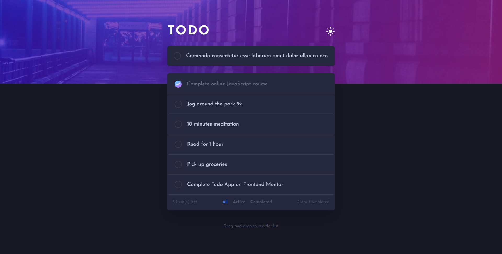

# Frontend Mentor - Todo app solution

This is a solution to the [Todo app challenge on Frontend Mentor](https://www.frontendmentor.io/challenges/todo-app-Su1_KokOW). Frontend Mentor challenges help you improve your coding skills by building realistic projects. 

## Table of contents

- [Overview](#overview)
  - [The challenge](#the-challenge)
  - [Screenshot](#screenshot)
  - [Links](#links)
- [My process](#my-process)
  - [Built with](#built-with)
- [Author](#author)

## Overview

### The challenge

Users should be able to:

- View the optimal layout for the app depending on their device's screen size
- See hover states for all interactive elements on the page
- Add new todos to the list
- Mark todos as complete
- Delete todos from the list
- Filter by all/active/complete todos
- Clear all completed todos
- Toggle light and dark mode
- **Bonus**: Drag and drop to reorder items on the list

### Screenshot

### Links

- Live Site URL: [todo-app]([https://your-live-site-url.com](https://todo-app-beta-seven-99.vercel.app/))

## My process

### Built with

- [React](https://reactjs.org/) - JS library
- React Hooks (useState, useEffect, useContext)
- [Tailwind CSS](https://tailwindcss.com/)
- [Zustand](https://docs.pmnd.rs/zustand/getting-started/introduction) - State Management

## Author

- Frontend Mentor - [@jpentinio](https://www.frontendmentor.io/profile/jpentinio)
